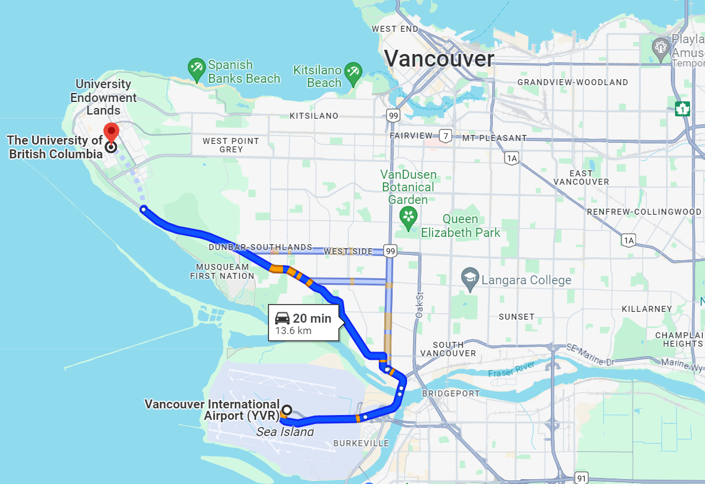

# Physics and Astronomy CA

加拿大高校的物理学与天文学项目学制与美国有显著的不同，且可能出现学院与学校要求不统一的情况，在申请时需要同时留意学院和学校的官方说明。一般而言，最终的录取决定先由学院做出，再由学校审批。

案例总览：

1. [University of British Columbia (UBC)](https://phas.ubc.ca/)  24fall M.Sc. [S同学](../../cases/24-fall-physicsstong-xue.md)&#x20;

## 名校介绍

[University of British Columbia (UBC)](https://phas.ubc.ca/) ([QS World Rank 34](https://www.topuniversities.com/universities/university-british-columbia) (2024)):

UBC诞生过两名诺贝尔物理学奖得主（1989年，1994年），其物理系研究部门齐全，下辖的分支有：Applied Physics, Astronomy/Astrophysics, Atomic/Molecular/Optics, Biophysics, Condensed Matter, Cosmology, Gravity, Medical Physics, Nuclear Physics, Particle Physics, and String Theory，涵盖了绝大多数现代物理学的研究方向。同时UBC物理学与天文学院也与外部机构合作密切，比如与LIGO合作的引力波探测项目，与马克斯-普朗克研究所合作的量子材料中心。

除此之外，不列颠哥伦比亚大学地理位置极其优越。三面环海，东面和温哥华市区之间有大片的森林。距离温哥华国际机场(YVR)车程仅有15-20分钟，出行非常方便。

<figure><figcaption>
<strong>从温哥华国际机场出发到UBC的路线和估计时间（当地时间18:54，晚高峰时段）</strong>
</figcaption></figure>

